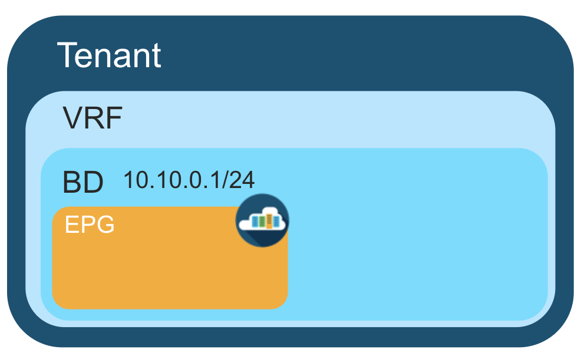

# What is this?

This repo was created as a demo for the live stream session "NetGru" by Cisco DevNet, where I was a guest. The main goal of this demo is to show how you can start using [Cisco Application Centric Infrastructure](https://www.cisco.com/c/en/us/solutions/collateral/data-center-virtualization/application-centric-infrastructure/solution-overview-c22-741487.html) (ACI) with Terraform [modules](https://learn.hashicorp.com/tutorials/terraform/module). The code represents a network-centric scenario where an ACI Tenant requires a single network segment, operating in a similar fashion to a legacy VLAN.




# What tools are used to create networks ?

 What tools are used to create networks:
- [Terraform](https://www.terraform.io/) 
- Cisco ACI Always-on Sandbox:
https://sandboxapicdc.cisco.com/  
- [Sandbox](fmcrestapisandbox.cisco.com) for [The Cisco Secure Firewall Management Center](https://www.cisco.com/c/en/us/products/collateral/security/firesight-management-center/datasheet-c78-736775.html)(FMC)
- [Netbox](https://docs.netbox.dev/en/stable/)

# Using Environmental Variables for Authentication:

You should use Terraform variables to securely supply the credentials or utilize environment variables. Here's how you can export the variables to your environment:
  ```
  export TF_VAR_aci_username=admin
  export TF_VAR_aci_password=!v3G@!4@Y
  export FMC_USERNAME=<Your Username for FMC>
  export FMC_PASSWORD=<Your Password for FMC>
  export FMC_HOST=fmcrestapisandbox.cisco.com
  export FMC_INSECURE_SKIP_VERIFY=true
  export NETBOX_API_TOKEN=<Your Netbox API Token>
  ```
Replace "Your Username for FMC", "Your Username for FMC" and "Your Netbox API Token" with your actual credentials. This approach ensures that sensitive information such as usernames and passwords are not hardcoded into your Terraform configuration files.

# How the repository is structured ?

While tenant network policies are configured separately from fabric access policies, tenant policies are not activated unless their underlying access policies are in place. Fabric access external-facing interfaces connect to external devices such as virtual machine controllers and baremetals, hosts, routers, firewalls. In the policy model, EPGs are tightly coupled with VLANs. The domain profile associated to the EPG contains the VLAN instance profile. The domain profile contains both the VLAN instance profile (VLAN pool) and the attacheable Access Entity Profile (AEP), which are associated directly with application EPGs. For more information, see [the Cisco's official guide](https://www.cisco.com/c/en/us/td/docs/switches/datacenter/aci/apic/sw/2-x/L2_config/b_Cisco_APIC_Layer_2_Configuration_Guide/b_Cisco_APIC_Layer_2_Configuration_Guide_chapter_011.html).  


So, three modules are defined to create networks, specifically in our case, to create one Application EPG:
1. tenant_policies module
2. fabric_policies module (Fabric Access Policies)
3. devvie_project module (Module for Network Creation)  

* epg_creation.tf file represents the way, how can you create one network in the root module. It is commented.

To call a child module you need to add [Instance of the module](https://www.terraform.io/language/modules/syntax) to the root module. Module Block have to consist:
- source argument
- arguments corresponding to input variables defined by the modules
- module output values

# How to use devvie project module to create networks?

In order to create a new L3 network you need to add Instance of the module in devvie_project.tf file located in the root module:

    ```
    module "devvie_project_1" {
     source          = "./devvie_project"
     name            = "devvie_project_1"
     tenant          = module.tenant_policies.devvie_tenant
     vrf             = module.tenant_policies.devvie_vrf
     vlan_id         = 15
     aep_access      = module.fabric_policies.aep_generic
     physical_domain = module.fabric_policies.physical_domain
     mode            = "regular"
     gateway_address = "192.168.15.1/24"
     route_scope     = ["public", "shared"]
     provided_contract = module.tenant_policies.established_ct
    }
    ```
"name" variable sets the project name of the network

"tenant" variable declares the tenant of the network (the output of the predefined resource). 

"vrf" variable defines the vrf of the network (the output of the predefined resource).

"vlan_id" variable depicts Vlan id of the project

"aep_access" variable assigns this EPG with specific AEP

"physical_domain" variable deploys EPG on a leaf port with a VLAN in a physical domain

"mode" stands for Layer 2 Interface Modes. Allowed values: trunk(regular)/access(untagged)/native(native). Default value: "regular".

"gateway_address" variable's name speaks for itself

"route_scope" the List of network visibility of the subnet. Allowed values are "private", "public" and "shared".

"provided_contract" variable identifies the default set of contracts that contract type is "Provided". 

# Additional Information

[DevNet Sandbox](https://developer.cisco.com/site/sandbox/)

[Terraform Provider Documentation](https://registry.terraform.io/providers/CiscoDevNet/aci/2.11.1/docs) for ACI

[Terraform Provider Documentation](https://registry.terraform.io/providers/CiscoDevNet/fmc/latest/docs) for FMC

[Terraform Provider Documentation](https://registry.terraform.io/providers/e-breuninger/netbox/3.7.3/docs) for Netbox

In the demo for the Netbox [netbox-docker](https://github.com/netbox-community/netbox-docker) was used. Token creation is described [here](https://docs.netbox.dev/en/stable/integrations/rest-api/#authenticating-to-the-api)

If you have any questions, feel free to ask ! =)
